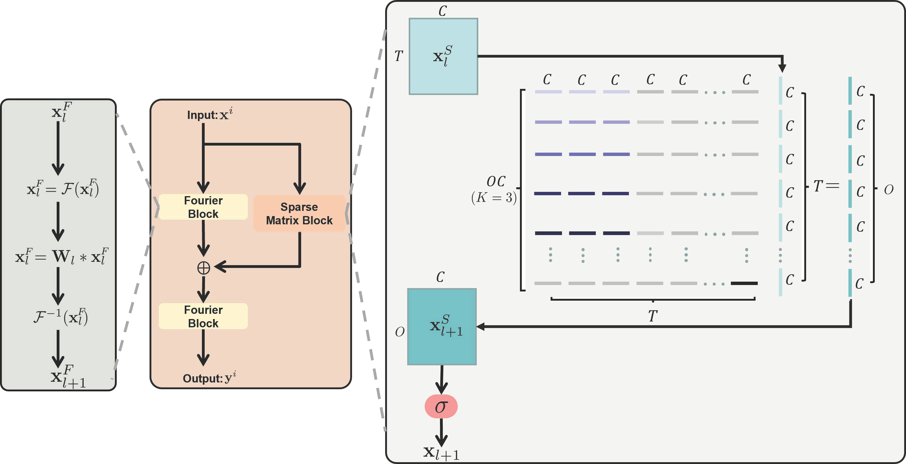
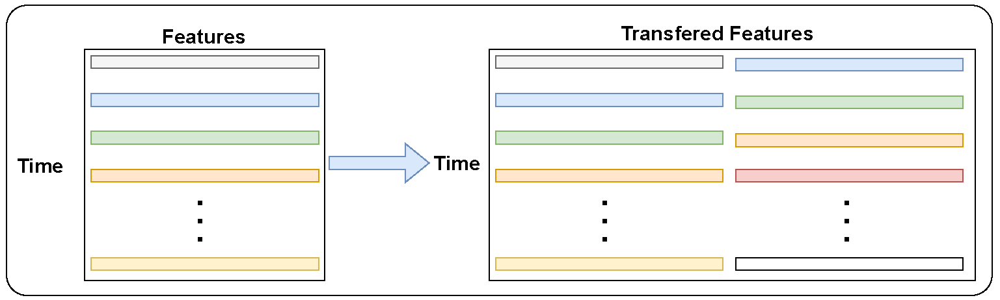
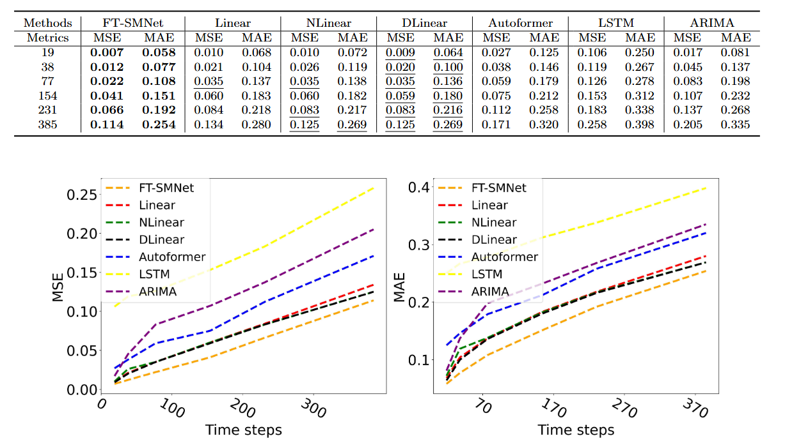

# FT-SMNet-pytorch
This repository contains the PyTorch implementation of FT-SMNet, a temporal transformation network designed for structural health monitoring time series data forecasting. The project was submitted to *Mechanical Systems and Signal Processing* under the title: *"FT-SMNet: Fourier Transform Sparse Matrix Network for Structural Health Monitoring Time Series Data Forecasting."*

## [FT-SMNet](https://www.sciencedirect.com/science/article/pii/S0888327024010951)


 **FT-SMNet** leverages both Fourier Transform and sparse matrices to process temporal data. The network primarily consists of two core modules: the **Fourier Transform (FT) block** and the **Sparse Matrix (SM) block**. The overall architecture of FT-SMNet is illustrated below:



## Implementation Details of Sparse Matrix Learning

The **Sparse Matrix (SM) block** in our paper aims to learn local feature correlations from time series data. However, implementing the sparse matrix module as depicted in the model architecture would require substantial GPU resources due to its sparsity. Therefore, we optimized the implementation of this module as shown below:



Given that the SM block focuses on learning local correlations within time series data, we restructured the original time series data like the above. This allows us to achieve our objective by learning from the transformed features rather than directly processing the raw data. This optimization is implemented in the `model/SM_block.py` file.

## Data

Datasets are stored in the `datasets` folder.

## Usage

### Batch Prediction for `FuXing.csv`
```bash
sh scripts/exp_FuXing.sh
```

### Real-Time Prediction for `FuXing.csv`
```bash
sh scripts/exp_real_time.sh
```

### Batch Prediction for `FuXing_MAV.csv`
```bash
sh scripts/exp_FuXing_MAV.sh
```

## Model Performance

The performance of FT-SMNet is visualized in the following figure:



This image provides an overview of FT-SMNet's prediction outcomes.


For more details, please refer to the article.
